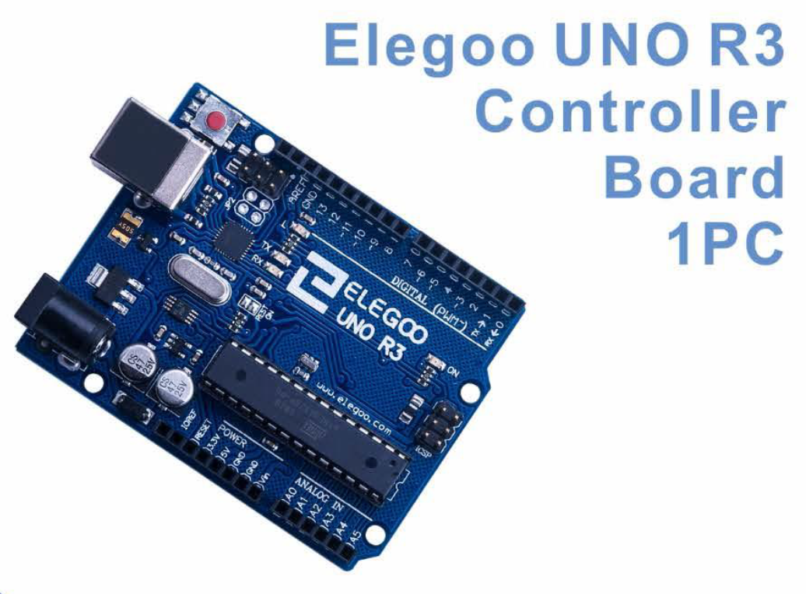

# Practicas con Arduino para Divulgación de la Ciecia

En este repositorio realizaremos algunas practicas básicas de electronica y computo embebido, también conocido como computación embebida o sistemas embebidos, se refiere a la integración de sistemas de cómputo en dispositivos o sistemas más grandes que no son considerados tradicionalmente como computadoras. En lugar de ejecutar aplicaciones de propósito general, estos sistemas están diseñados para realizar tareas específicas y están incrustados en otros productos, como electrodomésticos, automóviles, dispositivos médicos, equipos industriales, dispositivos de Internet de las cosas (IoT), entre otros.

Para ello utilizaremos algunos kits de educación stem bastante conocidos como lo es [Elegoo UNO R3](http://www.elegoo.com). Usando uno de sus dispositivos más representativos 

podremos explorar algunas aplicaciones sencillas que nos introducirán a este facinante mundo de la electronica.

El cómputo embebido implica la combinación de hardware y software especializados para proporcionar una funcionalidad específica y cumplir con los requisitos del sistema en el que se integra. Los sistemas embebidos suelen tener limitaciones de recursos, como: - potencia de procesamiento, 
- memoria y 
- capacidad de almacenamiento, 

por lo cual es necesario optimizar los procesos y los códigos que se encargarán del proceso para un rendimiento eficiente y una vida útil prolongada.

Estos sistemas pueden tener diferentes niveles de complejidad, desde microcontroladores simples hasta sistemas más avanzados basados en microprocesadores y sistemas operativos embebidos. El cómputo embebido juega un papel crucial en una amplia gama de aplicaciones, permitiendo:
- la automatización, 
- el control y 
- la conectividad en diversos campos, como 
    - la electrónica de consumo, 
    - la industria, 
    - la medicina, 
    - la automoción, 
    - etc.

0. [Instalación del IDE de Arduino](./chapter_00.md)

