# Instalación del IDE de Arduino

El IDE de Arduino (Entorno de Desarrollo Integrado de Arduino) es un software utilizado para programar y desarrollar aplicaciones para placas y microcontroladores Arduino. Proporciona una interfaz de usuario amigable que simplifica el proceso de programación y carga de código en los dispositivos Arduino.

El IDE de Arduino está basado en el entorno de programación Processing y utiliza un lenguaje de programación basado en C/C++. Proporciona una serie de herramientas y funciones que facilitan el desarrollo de proyectos con Arduino, como la edición de código, la compilación y la carga del programa en la placa Arduino.

El IDE de Arduino incluye características clásicas de cualquier IDE como: 
- la resaltado de sintaxis, 
- sugerencias de código, 
- verificación y corrección de errores, y 
- una interfaz para cargar el código en la placa Arduino a través de un cable USB. 

El IDE de Arduino proporciona acceso a una amplia biblioteca de funciones predefinidas que facilitan la interacción con los diferentes componentes y sensores utilizados en proyectos de Arduino.

El IDE de Arduino es multiplataforma y compatible con sistemas operativos como 
- Windows, 
- macOS y 
- Linux.

## Descarga el IDE o usan la versión On-line

Ve a la pagina de arduino:

[https://www.arduino.cc/en/software](https://www.arduino.cc/en/software)

descarga la versión para tu sistema operativo:

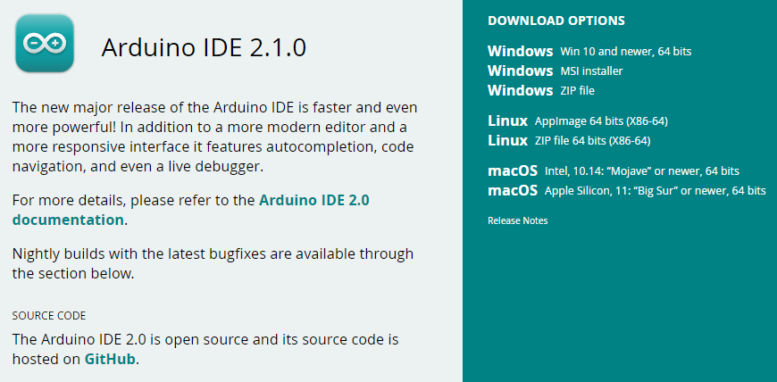

o utiliza la versión online

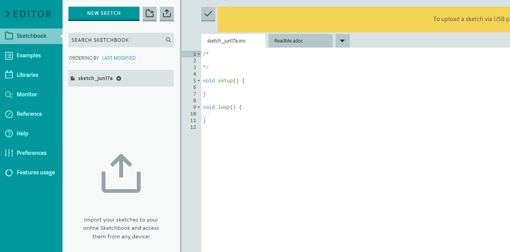

Exploraremos ambas versiones del IDE, sin embargo, nos enfocaremos más en la versión instalada.

La carpeta de Arduino incluye el propio programa de Arduino y los controladores que permiten que el Arduino se conecte al ordenador mediante un cable USB. 

Antes de que inicie el software de Arduino, vas a instalar a los controladores USB.

Conecte su cable USB en el Arduino y el en el USB en tu ordenador. La luz en el LED se enciende y usted puede obtener un mensaje de 'Found New Hardware' de Windows. 

IMPORTANTE:

**Ignore este mensaje y cancele cualquier intento que Windows hace para tratar de instalar los controladores automáticamente.**

Al utilizar el instalador de windows nos instalará todo lo necesario.

Al abrir el IDE 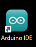 se empezarán a instalar varias de las dependencias que usualmente se instalaban manualmente como lo son los drivers USB para conectar nuestro arduino.

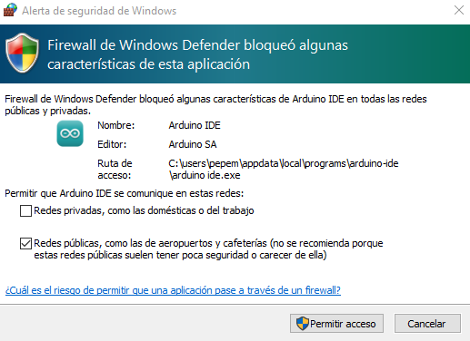
una vez le demos los persmisos suficientes:

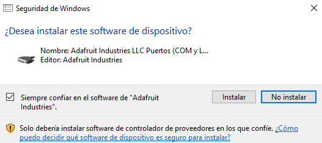
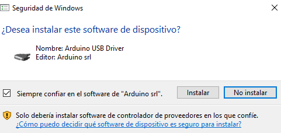
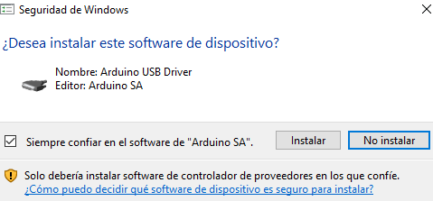
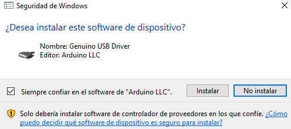

veremos que se instalaron los paquetes de manera automatica:

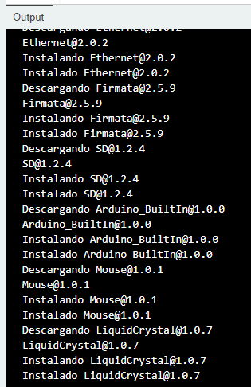

### Arduino serie Monitor (Windows, Mac, Linux)

El entorno de desarrollo integrado (IDE) de Arduino es el software de la plataforma Arduino. Debido al uso de la terminal es una gran parte del trabajo con Arduinos y otros microcontroladores, decidieron incluir una terminal de serie con el software. En el entorno de Arduino, esto se llama al Monitor serie.

### Realizar la conexión

El monitor de serie viene con cualquier versión del IDE Arduino. Para abrirlo, simplemente hagamos clic en el icono 
Serial Monitor en la esquina superior derecha:

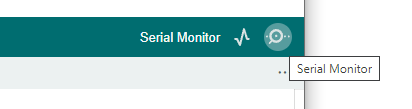

primero debera conectar su arduino a la computadora y seleccionar el puerto de conección en el IDE:
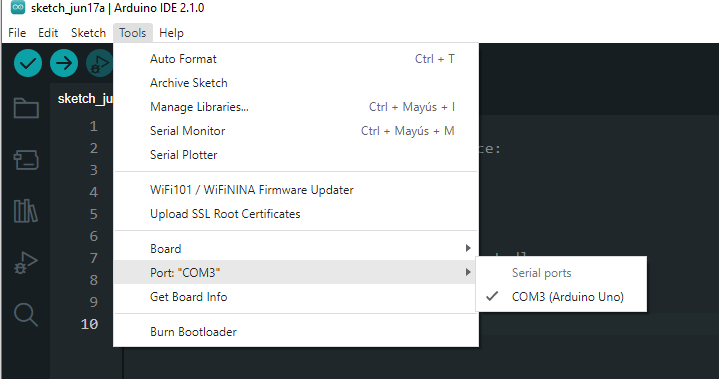

ahora selecciona el board que te corresponda:

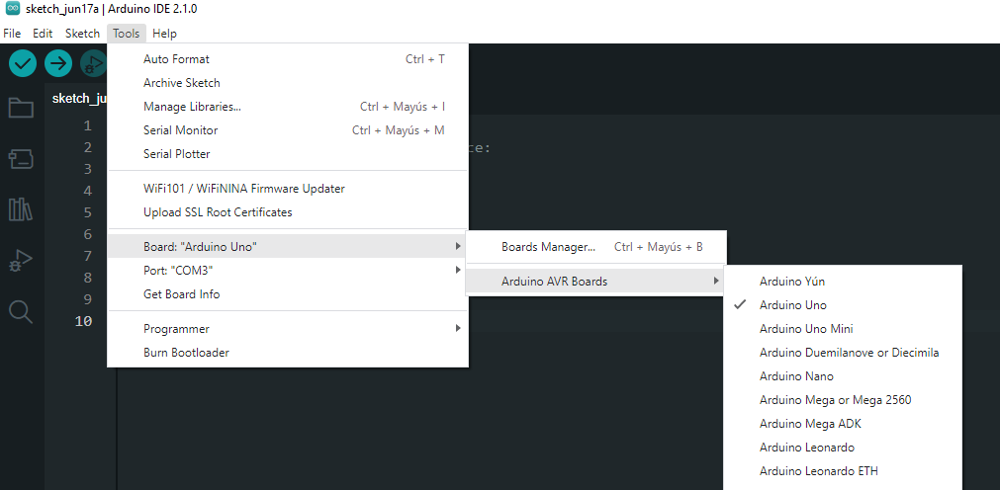

con ello deberias poder ver la terminal:

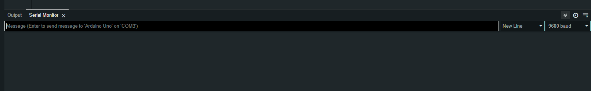

El Monitor Serial ha limitado opciones, pero lo suficiente para manejar la mayoría de sus necesidades de comunicación serial. El primer ajuste que se puede modificar es la velocidad en baudios. 

Haga clic en la velocidad en baudios en la lista desplegable en la parte derecha donde se  podrá seleccionar una velocidad apropiada. (9600 baudios)

Con esto ya estamos listo para la primer practica!!!
