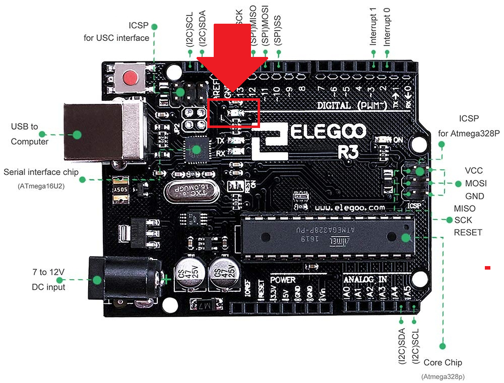
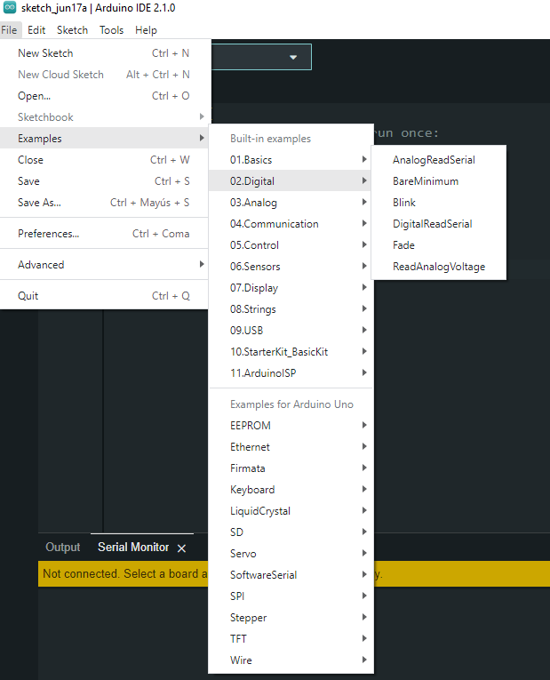

# Blink


En está practica aprenderemos como programar el tablero de regulador UNO R3 a parpadear el LED integrado de Arduino y cómo descargar programas.

Lista de componentes necesarios:
- Elegoo Uno R3


La placa de UNO R3 tiene unas filas de conectores a ambos lados que se utilizan para conectar varios dispositivos electrónicos y plug-in `escudos` que amplían su capacidad.

También tiene un indicador luminoso que podemos controlar desde las plantillas. Este LED está construido sobre el tablero de UNO R3 y se refiere a menudo comoel LED `L`  ya que es como se etiqueta en el tablero.



Podemos encontrar el LED `L` de la placa UNO R3, este LED parpadea cuando se conecta a un enchufe del USB. Esto es debido a que las placas se envían generalmente con el sketch de `Blink` pre-instalado.

Vamos a reprogramar el tablero UNO R3 con nuestro propio directorio de Blink y luego cambiar la tasa a la que parpadea.


El IDE de Arduino incluye una gran colección de dibujos de ejemplo, se puede cargar y usar. Esto incluye un directorio de ejemplo para hacer el parpadeo del LED de 'L'.
Cargar el sketch de 'Blink' que encontrarás en el sistema de menús del IDE bajo archivo > ejemplos > 01 conceptos básicos.



Al abrirlo veremos un código como el siguiente:

```arduino
/*
  Blink

  Turns an LED on for one second, then off for one second, repeatedly.

  Most Arduinos have an on-board LED you can control. On the UNO, MEGA and ZERO
  it is attached to digital pin 13, on MKR1000 on pin 6. LED_BUILTIN is set to
  the correct LED pin independent of which board is used.
  If you want to know what pin the on-board LED is connected to on your Arduino
  model, check the Technical Specs of your board at:
  https://www.arduino.cc/en/Main/Products

  modified 8 May 2014
  by Scott Fitzgerald
  modified 2 Sep 2016
  by Arturo Guadalupi
  modified 8 Sep 2016
  by Colby Newman

  This example code is in the public domain.

  https://www.arduino.cc/en/Tutorial/BuiltInExamples/Blink
*/

// the setup function runs once when you press reset or power the board
void setup() {
  // initialize digital pin LED_BUILTIN as an output.
  pinMode(LED_BUILTIN, OUTPUT);
}

// the loop function runs over and over again forever
void loop() {
  digitalWrite(LED_BUILTIN, HIGH);  // turn the LED on (HIGH is the voltage level)
  delay(1000);                      // wait for a second
  digitalWrite(LED_BUILTIN, LOW);   // turn the LED off by making the voltage LOW
  delay(1000);                      // wait for a second
}
```

Los códigos de ejemplo incluidos con el IDE de Arduino son de `sólo lectura`. 
Puesto que vamos a cambiar este sketch, lo primero que tenemos que hacer es guardar nuestra copia.
En el menú archivo en el IDE de Arduino, seleccione `Guardar como.` y guarde el dibujo con el nombre 'MyBlink'.

Aqui haremos cambios al parametro de la función delay, después daremos click en upload, y veremos inmediatamente el efecto del cambio de tiempo de encendido y apagado del LED `L`.

Como por ejemplo

```arduino
void loop() {
  digitalWrite(LED_BUILTIN, HIGH);  // turn the LED on (HIGH is the voltage level)
  delay(100);                      // wait for a second
  digitalWrite(LED_BUILTIN, LOW);   // turn the LED off by making the voltage LOW
  delay(100);                      // wait for a second
}
```

que provoca que la intermitencia sea mucho más frecuente. Con esto hemos terminado la primer practica llamada Blink.
